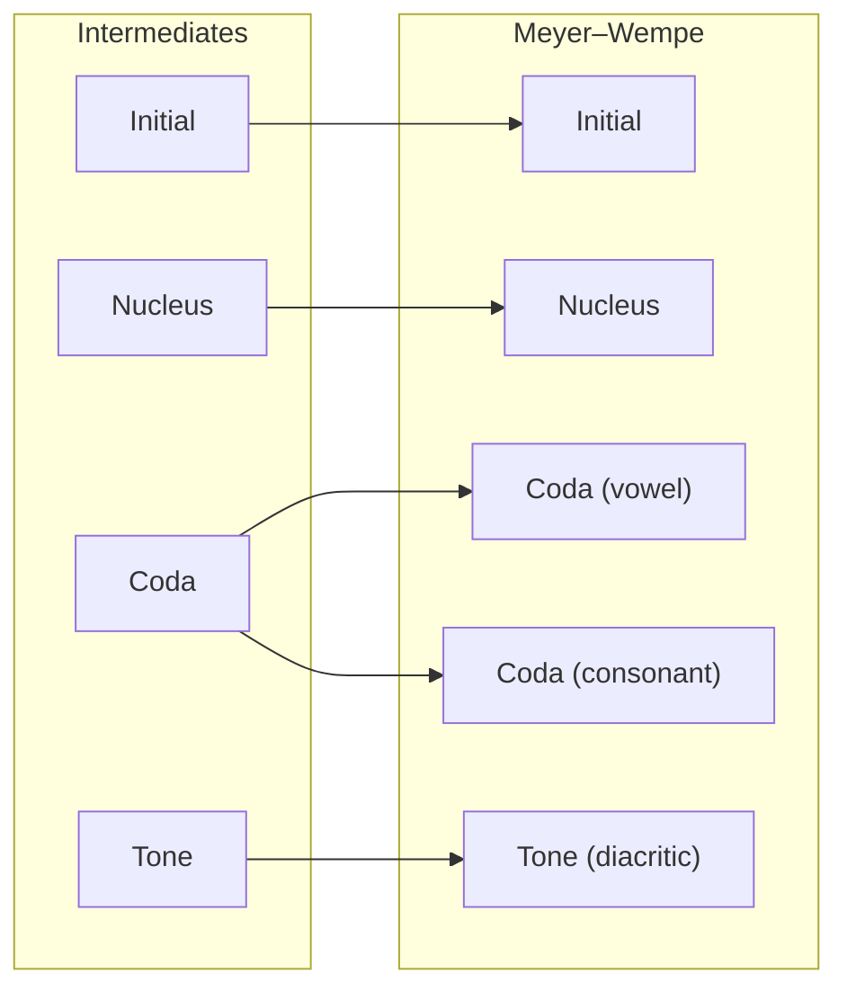

# 🍵 Yumcha


[](LICENSE)


A phonology-oriented romanization engine for Cantonese and other languages.

> "Yumcha" is a play on Cantonese words. While it traditionally means "drinking tea" (<ruby>飲<rt>jam2</rt>茶<rt>caa4</rt>), it also sounds like a "phonological lookup" (<ruby>音<rt>jam1</rt>查<rt>caa4</rt>).
> Just as tea brings people together, this engine aims to bridge different romanization and phonetic schemes!

> [!CAUTION]
> This project is in its **early stages** and undergoing active development. The API and functionality are **highly unstable** and subject to breaking changes without notice. **Do not use this in production environments.**

## ✨ Highlights

- [**Scheme-to-Scheme Conversion**](#conversion): Convert seamlessly between different romanization and phonetic schemes within the same language.
- [**Scheme Parsing**](#parsing): Parse strings to identify their phonological components and their IPA representations.
- [**Syllable Set Generation**](#getting-all-valid-syllables): Get all valid syllables via the phonology of the language or as represented by a specific scheme.
- **Zero Third-Party Dependencies:** Lightweight and easy to integrate into any project.
- **Type-hinted**: Built with modern Python 3.12+ type hints for better IDE support and readability.
- **Modular & Extensible**: Add new schemes by simply defining the representation structure, validation rules, and an IPA-to-symbol map!

## 🤔 Why Yumcha?

Sinitic romanization is fragmented and converting between systems often requires large handwritten mapping tables, which break down for edge cases such as unusual spellings and tone markings.

Yumcha provides a unified API to convert these schemes without requiring the user to write complex mapping logic or maintaining large mapping tables that can miss edge cases.

## 📋 Requirements

Python 3.12 or above.

## 📦 Installation

Install Yumcha using `pip`:

```bash
pip install git+https://github.com/tommycs127/yumcha.git
```

## 🚀 Usage

### Initialization

Import the `Yumcha` class from `yumcha` and the built-in language classes from `yumcha.languages`:

```py
from yumcha import Yumcha

# Use the bundled languages provided by the library...
from yumcha.languages import Cantonese

# ...or define your own custom subclasses!
from my_languages import MyLanguage
```

Then, pass the initialized language instances into the `Yumcha` constructor:

```py
languages = [
    Cantonese(),
    MyLanguage(),
]

yumcha = Yumcha(languages)
```

`Yumcha` registers these instances in an internal dictionary, using the lowercase name of each language class as the key. For example, `Cantonese` is indexed as `"cantonese"`, and `MyLanguage` becomes `"mylanguage"`. This same indexing logic applies to `Scheme` instances within each language.

#### Registering custom schemes

> [!NOTE]
> Custom schemes must conform to the language's underlying phonology; otherwise, `Yumcha` will raise a `PhonologyError` during initialization. Consult the `yumcha.languages.<language>.phonology` module for required phonemes.

Use `Language.add()` method to register custom schemes before initialization:

```py
from my_scheme import MyScheme

cantonese = Cantonese()
cantonese.add(MyScheme)

languages = [cantonese]

yumcha = Yumcha(languages)
```

### Getting available schemes

```py
print(yumcha.menu)
```

Output:

```text
{
    'cantonese': [
        'braille',
        'ile',
        'jyutping',
        'kuping',
        'kuping_alt',
        'meyer_wempe',
        'rao',
        'sidneylau',
        'slwong_phonetic',
        'slwong_roman',
        'yale'
    ]
}
```

### Conversion

Convert a Jyutping syllable to ILE:

```py
converted = y.convert(
    language_name="cantonese",
    from_scheme_name="jyutping",
    to_scheme_name="ile",
    text="seot1",
)
print(converted)  # soet7
```

### Parsing

> [!NOTE]
> Parsing methods **do not return a `str` object**, but an instance of a `Representation` subclass. To get a string, simply wrap the object in `str()`.

#### Scheme representation

Parse a Yale syllable into components:

```py
parsed = yumcha.parse(
    language_name="cantonese",
    scheme_name="yale",
    text="chēun",
)
print(repr(parsed))
```

Output:

```text
YaleRepresentation(
    initial='ch',
    nucleus_before_tone='e',
    tone='̄',
    nucleus_after_tone='u',
    coda_vowel='',
    tone_h='',
    coda_consonant='n'
)
```

#### IPA from scheme representation

Parse a Yale syllable into components and retrieve its IPA representation:

```py
parsed_ipa = yumcha.parse_to_ipa(
    language_name="cantonese",
    scheme_name="yale",
    text="chēun",
)
print(repr(parsed_ipa))
```

Output:

```text
CantoneseIPARepresentation(
    initial='t͡sʰ',
    nucleus='ɵ',
    coda='n',
    tone='˥'
)
```

### Getting all valid syllables

> [!NOTE]
>
> - This operation may take a few seconds to complete due to the volume of validated combinations generated.
> - The output list includes all theoretically valid syllables. While many are rare in common usage, they remain phonologically possible and pronounceable.
> - As validation rules and syllable constraints are updated during development, the total count of the list may fluctuate.

#### Phonology

Get all valid syllables via Cantonese phonology:

```py
all_syllables = yumcha.get_all_syllables(
    language_name="cantonese",
)
print(all_syllables)
```

Output (17,780 items):

```text
[CantoneseIPARepresentation(initial='f', nucleus='aː', coda='', tone='˥'),
 CantoneseIPARepresentation(initial='f', nucleus='aː', coda='', tone='˥˧'),
 CantoneseIPARepresentation(initial='f', nucleus='aː', coda='', tone='˧'),
 CantoneseIPARepresentation(initial='f', nucleus='aː', coda='', tone='˧˥'),
 CantoneseIPARepresentation(initial='f', nucleus='aː', coda='', tone='˨'),
 CantoneseIPARepresentation(initial='f', nucleus='aː', coda='', tone='˩'),
 ...,
 CantoneseIPARepresentation(initial='ʔ', nucleus='ʊ', coda='ŋ', tone='˥˧'),
 CantoneseIPARepresentation(initial='ʔ', nucleus='ʊ', coda='ŋ', tone='˧'),
 CantoneseIPARepresentation(initial='ʔ', nucleus='ʊ', coda='ŋ', tone='˧˥'),
 CantoneseIPARepresentation(initial='ʔ', nucleus='ʊ', coda='ŋ', tone='˨'),
 CantoneseIPARepresentation(initial='ʔ', nucleus='ʊ', coda='ŋ', tone='˩'),
 CantoneseIPARepresentation(initial='ʔ', nucleus='ʊ', coda='ŋ', tone='˩˧')]
```

#### Scheme

Get all valid syllables represented by the Sidney Lau scheme:

```py
all_syllables = yumcha.get_all_syllables(
    language_name="cantonese",
    scheme_name="sidneylau",
)
print(all_syllables)
```

Output (10,360 items):

```text
[SidneyLauRepresentation(initial='f', nucleus='aa', coda='', tone='1°'),
 SidneyLauRepresentation(initial='f', nucleus='aa', coda='', tone='1'),
 SidneyLauRepresentation(initial='f', nucleus='aa', coda='', tone='3'),
 SidneyLauRepresentation(initial='f', nucleus='aa', coda='', tone='2'),
 SidneyLauRepresentation(initial='f', nucleus='aa', coda='', tone='6'),
 SidneyLauRepresentation(initial='f', nucleus='aa', coda='', tone='4'),
 ...,
 SidneyLauRepresentation(initial='', nucleus='u', coda='ng', tone='1'),
 SidneyLauRepresentation(initial='', nucleus='u', coda='ng', tone='3'),
 SidneyLauRepresentation(initial='', nucleus='u', coda='ng', tone='2'),
 SidneyLauRepresentation(initial='', nucleus='u', coda='ng', tone='6'),
 SidneyLauRepresentation(initial='', nucleus='u', coda='ng', tone='4'),
 SidneyLauRepresentation(initial='', nucleus='u', coda='ng', tone='5')]
```

### Getting the coverage of a scheme

> [!NOTE]
> This function is implemented by generating all valid syllables. Refer to the notes in the [Getting all valid syllables](#getting-all-valid-syllables) section for details.

Calculate the phonological coverage of the Meyer–Wempe scheme:

```py
coverage = yumcha.get_coverage(
    language_name="cantonese",
    scheme_name="meyer_wempe",
)
print(coverage)  # 0.5014623172103487
```

The closer this value is to `1`, the more phonologically complete the scheme's design is.

## 🔤 Supported schemes

### Cantonese

| Scheme name                                           | Example      | Scheme code       | Note                                                  |
| ----------------------------------------------------- | ------------ | ----------------- | ----------------------------------------------------- |
| Braille                                               | `⠭⠎⠀`        | `braille`         |                                                       |
| Institute of Language in Education Scheme             | `tsoen1`     | `ile`             |                                                       |
| Jyutping                                              | `ceon1`      | `jyutping`        |                                                       |
| Kuping                                                | `tśeon55^1`  | `kuping`          | A romanization scheme I designed!                     |
| Kuping (Alternative)                                  | `ts'eon55^1` | `kuping_alt`      | Ditto.                                                |
| Meyer–Wempe                                           | `ts'un`      | `meyer_wempe`     |                                                       |
| Cantonese Transliteration Scheme (Rao's Romanization) | `cên1`       | `rao`             |                                                       |
| Sidney Lau                                            | `chun1°`     | `sidneylau`       |                                                       |
| S. L. Wong (Romanization)                             | `ˈtseun`     | `slwong_roman`    | Conventional numeral tone marking is not implemented. |
| S. L. Wong (Phonetic)                                 | `ˈtsœn`      | `slwong_phonetic` | Ditto.                                                |
| Yale                                                  | `chēun`      | `yale`            |                                                       |

## ⚙️ How it works

Yumcha converts between romanization and phonetic schemes by using a **phonologically-aware three-stage conversion process**:

### 1. Parse to Intermediate Representation

Yumcha parses input text into a **scheme-specific structured representation** that explicitly identifies phonological components.

For example, `chēun` in Cantonese Yale will be parsed as the following structure:

| Component                      | Content (`str` object) |
| ------------------------------ | ---------------------- |
| **Initial**                    | `ch`                   |
| **Nucleus** (before diacritic) | `e`                    |
| **Tone** (diacritic)           | ` ̄`                    |
| **Nucleus** (after diacritic)  | `u`                    |
| **Coda** (vowel)               | _(empty string)_       |
| **Tone** (letter `h`)          | _(empty string)_       |
| **Coda** (consonant)           | `n`                    |

> [!NOTE]
> Components must be defined in **sequential (left-to-right) order** to ensure correct parsing.

### 2. Convert to IPA

The structured representation is converted into a universal intermediate format, primarily the **International Phonetic Alphabet (IPA)**.

> [!NOTE]
> The intermediate format is not strictly limited to IPA. Conventional non-IPA symbol sets may be used, provided they consistently and uniquely identify the phonological components within the engine's internal mapping logic.

The graph below shows the mapping from the Cantonese Yale scheme to the intermediates:

```mermaid
graph LR
  subgraph CantoneseYale["Cantonese Yale"]
    I_["Initial"]
    NBD_["Nucleus (before diacritic)"]
    TD_["Tone (diacritic)"]
    NAD_["Nucleus (after diacritic)"]
    CV_["Coda (vowel)"]
    TH_["Tone (letter h)"]
    CC_["Coda (consonant)"]
  end
  subgraph Intermediates["Intermediates"]
    _I_["Initial"]
    _N_["Nucleus"]
    _C_["Coda"]
    _T_["Tone"]
  end
  I_ --> _I_
  NBD_ --> _N_
  TD_ --> _T_
  NAD_ --> _N_
  CV_ --> _C_
  TH_ --> _T_
  CC_ --> _C_
```



Yumcha implements a **context-aware lookup mechanism**. if a parsed structure matches a predefined phonological context, the system prioritizes a context-specific mapping over a literal symbol-to-symbol translation. This logic is fully reversible, ensuring robust bidirectional conversion between schemes.

### 3. Convert to Target Scheme

Finally, the IPA representation is mapped to the target scheme, preserving all phonological information expressible by the target format.

The graph below shows the mapping from the intermediates to the Meyer–Wempe scheme:



This process results in the following structure:

| Component            | Content (`str` object) |
| -------------------- | ---------------------- |
| **Initial**          | `ts'`                  |
| **Nucleus**          | `u`                    |
| **Coda** (vowel)     | _(empty string)_       |
| **Tone** (diacritic) | _(empty string)_       |
| **Coda** (consonant) | `n`                    |

Consequently, the final output text is `ts'un`.

## 🚫 Limitations

### No Tone Sandhi

Tone sandhi depends on linguistic context (e.g., phonological environment) and is therefore out of scope for this project.

### Limitations of Certain Schemes

#### Tone Information Loss during Conversion

Some schemes include specialized markers for detailed tone contours. For example, the Sidney Lau scheme distinguishes between the high-flat tone (`1°`) and the high-falling tone (`1`). In contrast, other schemes lack this distinction; in Jyutping, `1` represents both contours, where the high level tone is assumed by default. Consequently, this precise tonal granularity may be lost during scheme-to-scheme conversion.

#### Unrepresentable Syllables

Some schemes are designed in a way that loses certain phonological distinctions.

For example, the S. L. Wong Romanization scheme uses `e` for `[ɛː]` and `u` for `[u̯]`, but it uses `eu` for `[yː]`. This prevents the scheme from being able to represent `[ɛːu̯]`. Therefore, converting an input such as `deu6` (in Jyutping) to the S. L. Wong scheme results in no valid output.

> [!NOTE]
> Such constraints must be explicitly defined in the `validate()` method of any subclass inheriting from the `Representation` class. Without properly defined constraints, exceptions or unexpected results may occur.

## 🛣️ Roadmap

### Documentations

- [x] README.md
- [ ] Tutorial on adding custom languages
- [ ] Tutorial on adding custom schemes

### Functionalities

- [x] Conversion
- [x] Parsing
- [x] Generating all valid syllables
- [x] Calculating the coverage of a scheme

### Schemes

#### Cantonese


- [ ] Barnett–Chao
- [ ] ~~Bopomofo (Zhuyin) by the Commission on the Unification of Pronunciation~~
  - Will not be implemented until Unicode supports the missing characters.
- [ ] Bopomofo (Zhuyin) by the People's Government Culture and Education Department
- [x] Braille
- [x] Cantonese Transliteration Scheme (Rao's Romanization)
- [x] Institute of Language in Education Scheme
- [x] Jyutping
- [x] Kuping
- [x] Meyer–Wempe
- [x] S. L. Wong (Romanization)
- [x] S. L. Wong (Phonetic)
- [x] Sidney Lau
- [ ] Standard Romanisation
- [x] Yale
- [ ] Yựtyựt

#### Mandarin


- [ ] Bopomofo (Zhuyin)
- [ ] Gwoyeu Romatzyh
- [ ] Hanyu Pinyin
- [ ] Palladius
- [ ] Tongyong Pinyin
- [ ] Wade–Giles
- [ ] Yale

#### Hokkien


- [ ] Pe̍h-ōe-jī
- [ ] Phofsit Daibuun
- [ ] Taiwanese Language Phonetic Alphabet
- [ ] Tâi-lô

## 🙏 Acknowledgments

This project implements romanization and phonetic standards developed by linguists and language communities, whose foundational work made this project possible.

## 📜 License

Yumcha is licensed under the MIT License. See the [LICENSE file](LICENSE) for the full license text.
