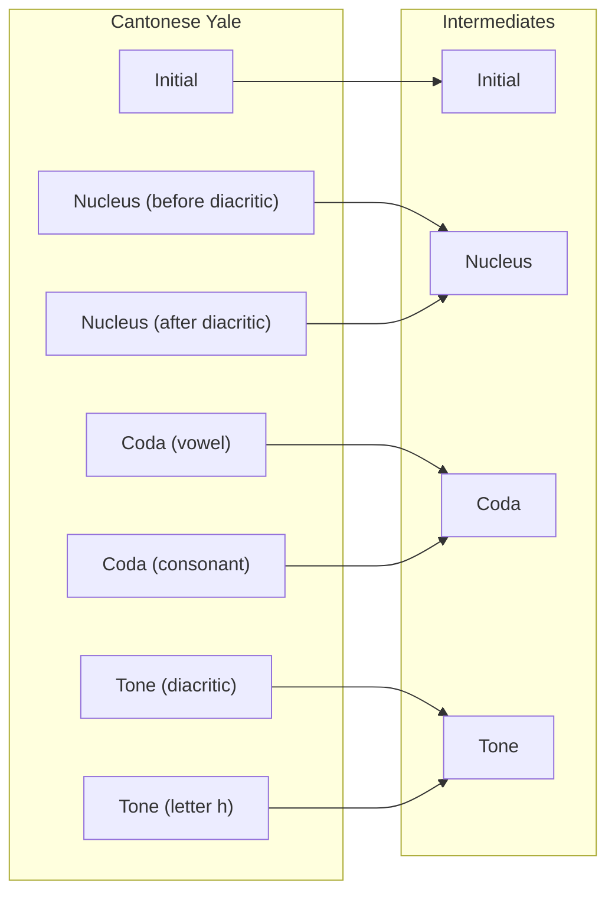
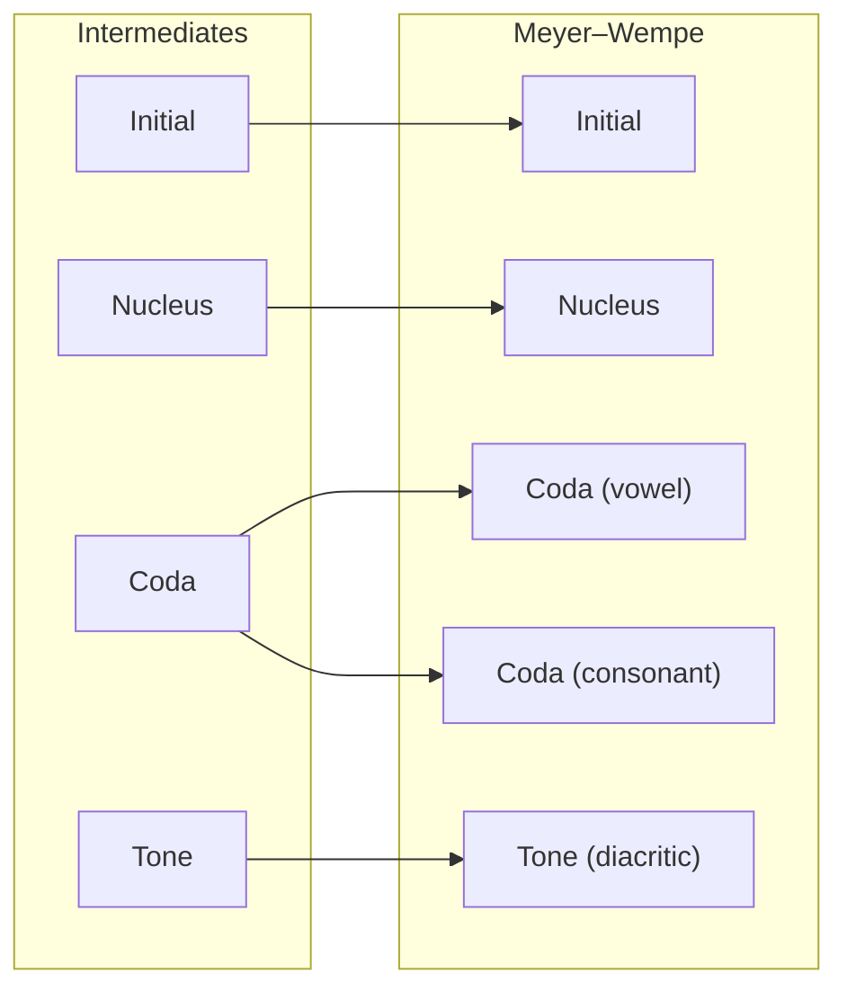

# ⚙️ How it works

Yumcha converts between romanization and phonetic schemes by using a **phonologically-aware three-stage conversion process**:

## 1. Parse to Intermediate Representation

Yumcha parses input text into a **scheme-specific structured representation** that explicitly identifies phonological components.

For example, `chēun` in Cantonese Yale will be parsed as the following structure:

| Component                      | Content (`str` object) |
| ------------------------------ | ---------------------- |
| **Initial**                    | `ch`                   |
| **Nucleus** (before diacritic) | `e`                    |
| **Tone** (diacritic)           | ` ̄`                    |
| **Nucleus** (after diacritic)  | `u`                    |
| **Coda** (vowel)               | _(empty string)_       |
| **Tone** (letter `h`)          | _(empty string)_       |
| **Coda** (consonant)           | `n`                    |

> [!NOTE]
> Components must be defined in **sequential (left-to-right) order** to ensure correct parsing. Because Yumcha decomposes combining characters for fine-grained parsing, schemes that include combining characters must have their diacritics extracted as **a single component**.

## 2. Convert to IPA

The structured representation is converted into a universal intermediate format, primarily the **International Phonetic Alphabet (IPA)**.

> [!NOTE]
> The intermediate format is not strictly limited to IPA. Conventional non-IPA symbol sets may be used, provided they consistently and uniquely identify the phonological components within the engine's internal mapping logic.

The graph below shows the mapping from the Cantonese Yale scheme to the intermediates:

## 3. Lookup and Map

Yumcha implements a **context-aware lookup mechanism**. if a parsed structure matches a predefined phonological context, the system prioritizes a context-specific mapping over a literal symbol-to-symbol translation. This logic is fully reversible, ensuring robust bidirectional conversion between schemes.

<small>(🚧 This section is to be completed.)</small>

## 4. Convert to Target Scheme

Finally, the IPA representation is mapped to the target scheme, preserving all phonological information expressible by the target format.

The graph below shows the mapping from the intermediates to the Meyer–Wempe scheme:

This process results in the following structure:

| Component            | Content (`str` object) |
| -------------------- | ---------------------- |
| **Initial**          | `ts'`                  |
| **Nucleus**          | `u`                    |
| **Coda** (vowel)     | _(empty string)_       |
| **Tone** (diacritic) | _(empty string)_       |
| **Coda** (consonant) | `n`                    |

Consequently, the final output text is `ts'un`.
