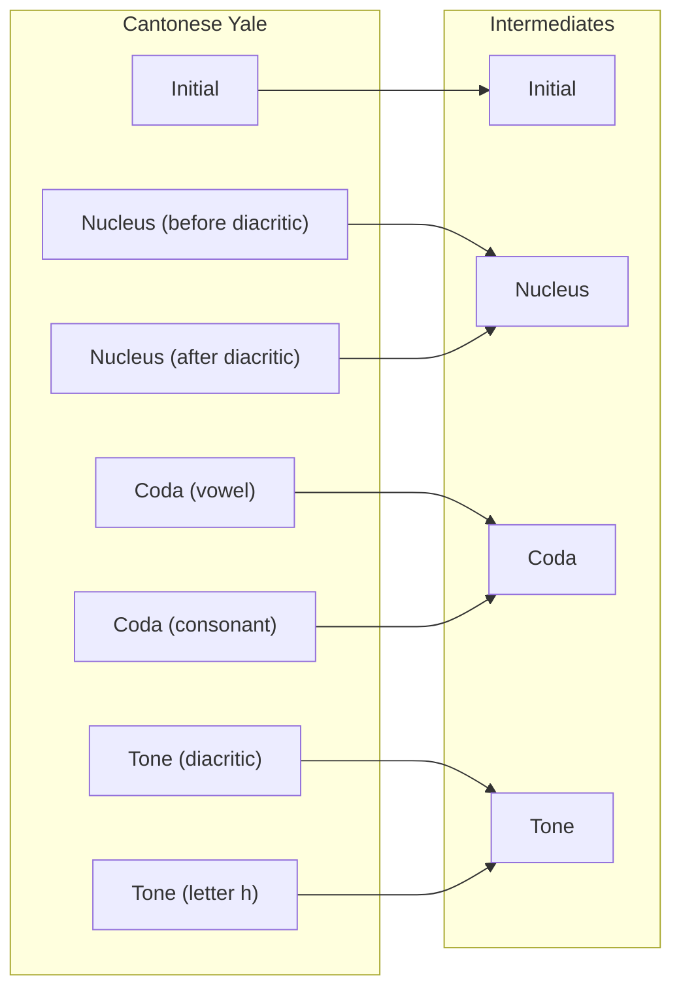
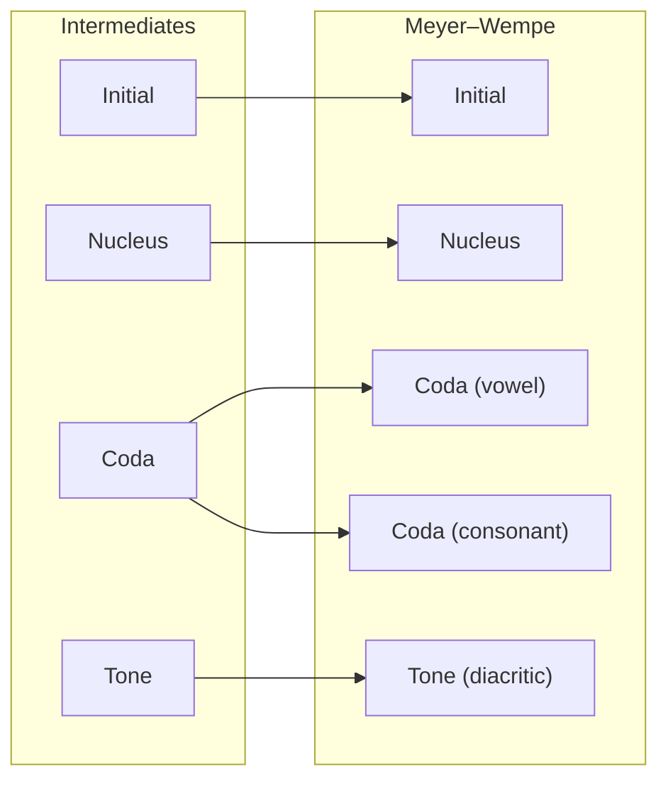

# ⚙️ How it works

## 1. Phonology Definition

The best way to understand how Yumcha works is to look at how we represent the sounds of a language—specifically, which sounds exist and under what conditions they are pronounced.

By organizing these sounds into a structured system, we establish a language's phonology, where phonemes are recorded and ordered. This structure is the core concept behind Yumcha.

In Yumcha, the first step is to define the inventory of sounds in a language and their respective positions. This is achieved by defining a tuple that contains all individual sounds as nested tuples.

Throughout this documentation, we will use **Cantonese** as our primary example.

### Syllable Structure

A Cantonese syllable typically consists of four parts: an **initial**, a **nucleus**, a **coda**, and a **tone**. While the nucleus and tone are required to form a valid syllable, all four parts are conventionally defined in this specific sequence for clarity. Yumcha implements this concept directly into code:

```py
from dataclasses import dataclass

from yumcha.language.scheme.representation import Representation


@dataclass(frozen=True)
class CantoneseRepresentation(Representation):
    REQUIRED = ("nucleus", "tone")
    initial: str
    nucleus: str
    coda: str
    tone: str
```

By leveraging Python’s built-in `dataclass` library and Yumcha’s core modules, this concise definition is sufficient to build the foundation for Cantonese phonology.

### Validation

Cantonese has `[m]` as both an initial and a coda, and a syllabic consonant `[m̩]` as a nucleus. While it is technically possible to combine these into `[mm̩]` or `[m̩m]`, such combinations are redundant in most linguistic analyses.

To handle these rules, the `Representation` class provides a `validate` method to check the legitimacy of a syllable:

```py
from dataclasses import dataclass

from yumcha.language.scheme.representation import Representation, ValidationError


@dataclass(frozen=True)
class CantoneseRepresentation(Representation):
    REQUIRED = ("nucleus", "tone")
    initial: str
    nucleus: str
    coda: str
    tone: str

    def validate(self) -> None:
        invalid_initial_nucleus_comb = {
            "m": "m̩",
            "ŋ": "ŋ̍",
        }

        if (
            self.initial in invalid_initial_nucleus_comb
            and self.nucleus == invalid_initial_nucleus_comb[self.initial]
        ):
            raise ValidationError(
                f"initial '{self.initial}' cannot be with nucleus '{self.nucleus}'"
            )

        # Additional checks...
```

With this method, an exception is raised whenever a `CantoneseRepresentation` is initialized with an invalid combination.

### Scheme Definition

At first glance, the `CantoneseRepresentation` class may look like any other method for transcribing Cantonese syllables. However, because it allows for the exhaustive listing of every phonemic combination (modern or historical), it functions as an **intermediate scheme** to bridge different transcription systems—much like the International Phonetic Alphabet (IPA) does for global languages.

We can define the scheme for this representation as follows:

```py
from typing import Generic

from yumcha.language.scheme import Scheme
from yumcha.language.scheme.representation import (
    IntermediateRepresentationT,
    RepresentationT,
)

from .representation import CantoneseRepresentation


class CantoneseScheme(Scheme, Generic[RepresentationT, IntermediateRepresentationT]):
    @property
    def intermediate_representation_class(self) -> type[CantoneseRepresentation]:
        return CantoneseRepresentation
```

With the `intermediate_representation_class` property acting as an anchor, the `CantoneseScheme` class becomes the foundation for all Cantonese transcription schemes within Yumcha.

### Listing Phonemes

Once the scheme is established, listing the sounds for every part of the language becomes straightforward:

```py
from yumcha.language.scheme.feature.types import FeatureTuple

PHONOLOGY: tuple[FeatureTuple, ...] = (
    ("p", ..., ..., ...),
    ("pʰ", ..., ..., ...),
    ("m", ..., ..., ...),
    ("f", ..., ..., ...),
    # Skipping remaining initials...
    (..., "aː", ..., ...),
    (..., "ɐ", ..., ...),
    (..., "ɛː", ..., ...),
    (..., "e", ..., ...),
    # Skipping remaining nuclei...
    (..., ..., "", ...),
    (..., ..., "i̯", ...),
    (..., ..., "y̯", ...),
    (..., ..., "u̯", ...),
    # Skipping remaining codas...
    (..., ..., ..., "˥"),
    (..., ..., ..., "˥˧"),
    (..., ..., ..., "˧˥"),
    (..., ..., ..., "˧"),
    (..., ..., ..., "˩"),
    (..., ..., ..., "˩˧"),
    (..., ..., ..., "˨"),
)
```

In this structure, every nested tuple contains four values, each corresponding to the sequential parts defined in the `CantoneseRepresentation` class.

> [!NOTE]
> The intermediate format is not strictly limited to IPA. Conventional non-IPA symbol sets may be used, provided they consistently and uniquely identify the phonological components within the engine's internal mapping logic.

## 2. Text Parsing

Yumcha utilizes Python’s built-in `re` (regular expression) library to parse input text into a **scheme-specific structured representation** that explicitly identifies orthographical components.

For example, the syllable `chēun` in Cantonese Yale is parsed into the following structure:

| Component                      | Content (`str` object) |
| ------------------------------ | ---------------------- |
| **Initial**                    | `ch`                   |
| **Nucleus** (before diacritic) | `e`                    |
| **Tone** (diacritic)           | ` ̄`                    |
| **Nucleus** (after diacritic)  | `u`                    |
| **Coda** (vowel)               | _(empty string)_       |
| **Tone** (letter `h`)          | _(empty string)_       |
| **Coda** (consonant)           | `n`                    |

> [!NOTE]
> As previously mentioned, components must be defined in **sequential (left-to-right) order** to ensure correct parsing. Because Yumcha decomposes combining characters for fine-grained parsing, schemes that include combining characters must have their diacritics extracted as **a single component**.

## 3. Scheme-to-Intermediate Conversion

The structured representation is converted into an intermediate format by the defined map.

The graph below shows the mapping from the Cantonese Yale scheme to the intermediates:



### Lookup and Map

Yumcha implements a **context-aware pattern matching mechanism**. If a parsed structure matches a predefined orthographical or phonological context, the system prioritizes a context-specific mapping over a literal symbol-to-symbol translation.

At runtime, each scheme map is compiled into a `PatternMap` object, where:

- The **key** side represents intermediate features (e.g., initial / nucleus / coda / tone)
- The **value** side represents scheme-specific features
- `...` is used as a wildcard, meaning "this part is not constrained by this rule"

This allows a map to express both:

- **General rules** (broad defaults)
- **Specific overrides** (special cases with extra constraints)

#### Matching priority

When converting, Yumcha:

1. Collects all rules compatible with the query tuple.
2. Sorts them by specificity (rules with more non-wildcard positions are tried first).
3. Merges compatible candidate rules left-to-right until all output fields are filled.
4. Raises an error if no consistent full output can be formed.

This ensures that narrow context rules win over broad defaults while still allowing partial rules to collaborate into one final result.

#### Why this matters

Some orthographies reuse the same symbol for multiple sounds and rely on context to disambiguate. A direct one-to-one table would fail here.

For example, a broad rule may map a tone to a default tone digit, while a more specific checked-syllable rule (e.g., coda `p`, `t` and `k`) overrides that digit to preserve entering-tone categories in a target scheme.

#### One-way and inverse extensions

In addition to the main map, schemes may define:

- **`one_way_map`**: extra forward-only mappings used in intermediate → scheme conversion.
- **`inverse_map`**: extra reverse-only mappings used in scheme → intermediate conversion.

This is useful when a writing system collapses distinctions (many-to-one) or introduces historical spellings. It lets Yumcha remain practical and reversible where possible, without forcing unrealistic strict bijection for every scheme.

## 4. Intermediate-to-Scheme Conversion

Finally, the intermediate representation is mapped to the target scheme, trying to preserve all phonological information expressible by the target format.

The graph below shows the mapping from the intermediates to the Meyer–Wempe scheme:



This process results in the following structure:

| Component            | Content (`str` object) |
| -------------------- | ---------------------- |
| **Initial**          | `ts'`                  |
| **Nucleus**          | `u`                    |
| **Coda** (vowel)     | _(empty string)_       |
| **Tone** (diacritic) | _(empty string)_       |
| **Coda** (consonant) | `n`                    |

Consequently, the final output text is `ts'un`.
